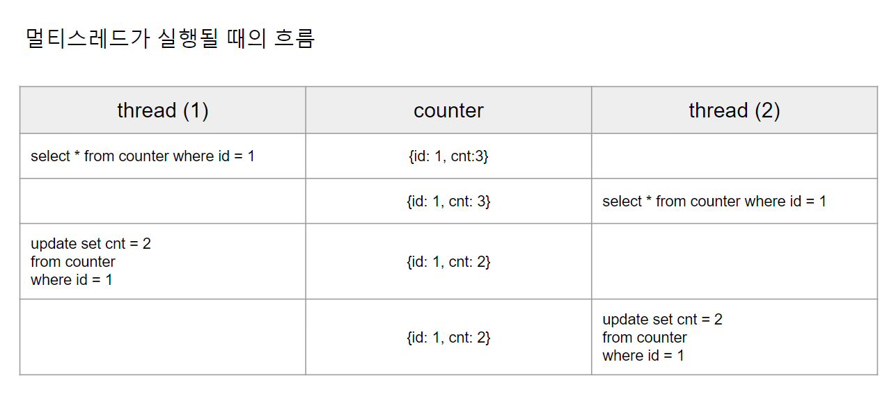

# 1. Intro

예제 설명은 추후 하기로 하고, 일단 예제들을 정리해볼까 한다. (오늘 퇴근 후에 반드시 정리할 예정)


# 예제

Entity - `counter/domain`

- decrease() : 감소연산.

```java
package io.study.cuncurrency.counter.domain;

import lombok.Getter;

import javax.persistence.Entity;
import javax.persistence.GeneratedValue;
import javax.persistence.GenerationType;
import javax.persistence.Id;

@Entity
public class Counter {

    @Id
    @GeneratedValue(strategy = GenerationType.IDENTITY)
    private Long id;

    @Getter
    private Long cnt;

    public Counter(){}

    public Counter(Long id, Long cnt){
        this.id = id;
        this.cnt = cnt;
    }

    public void decrease(Long diff){
        if(this.cnt < 0){
            throw new RuntimeException("카운터를 이미 넘어섰습니다... ");
        }

        this.cnt = this.cnt - diff;
    }
}
```

<br>

`counter/repository`

```java
package io.study.cuncurrency.counter.repository;

import io.study.cuncurrency.counter.domain.Counter;
import org.springframework.data.jpa.repository.JpaRepository;

public interface CounterRepository extends JpaRepository<Counter, Long> {
}

```

<br>

`counter/service`

```java
package io.study.cuncurrency.counter.service;

import io.study.cuncurrency.counter.domain.Counter;
import io.study.cuncurrency.counter.repository.CounterRepository;
import org.springframework.stereotype.Service;

@Service
public class CounterService {

    private final CounterRepository counterRepository;

    public CounterService(CounterRepository counterRepository){
        this.counterRepository = counterRepository;
    }

    public void decrease(Long id, Long diff){
        // get counter
        // counter 감소 연산
        // 결과 저장

        Counter counter = counterRepository.findById(id).orElseThrow();

        counter.decrease(diff);

        counterRepository.saveAndFlush(counter);
    }
}
```

<br>

`counter/service/CounterServiceTest`

```java
package io.study.cuncurrency.counter.service;

import io.study.cuncurrency.counter.domain.Counter;
import io.study.cuncurrency.counter.repository.CounterRepository;
import org.assertj.core.api.Assertions;
import org.junit.jupiter.api.AfterEach;
import org.junit.jupiter.api.BeforeEach;
import org.junit.jupiter.api.Test;
import org.springframework.beans.factory.annotation.Autowired;
import org.springframework.boot.test.context.SpringBootTest;

import java.util.concurrent.CountDownLatch;
import java.util.concurrent.ExecutorService;
import java.util.concurrent.Executors;

@SpringBootTest
public class CounterServiceTest {

    @Autowired
    private CounterService counterService;

    @Autowired
    private CounterRepository counterRepository;

    @BeforeEach
    public void before(){
        Counter counter = new Counter(1L, 100L);
        counterRepository.saveAndFlush(counter);
    }

    @AfterEach
    public void after(){
        counterRepository.deleteAll();
    }

    @Test
    public void 카운터_감소연산_테스트(){
        counterService.decrease(1L, 1L);

        Counter counter = counterRepository.findById(1L).orElseThrow();

        Assertions.assertThat(99L).isEqualTo(counter.getCnt());
    }

}
```

<br>

# 카운터 문제

100이라는 cnt 라는 숫자가 `counter` 테이블의 `cnt` 컬럼에 저장되어 있다. 

멀티 스레드 하에서 100 번의 감소연산을 각 스레드가 감소연산을 한번씩 정확히 수행해서 0이 되도록 프로그램을 작성해보자.

<br>

# 실패하는 경우

아래의 예제는 ... 일단 그림만 저장해두고, 퇴근 후에 다시 정리 예정




