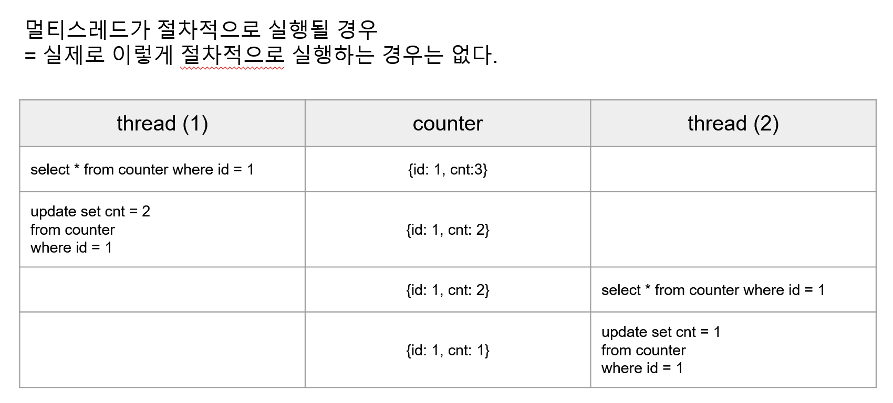
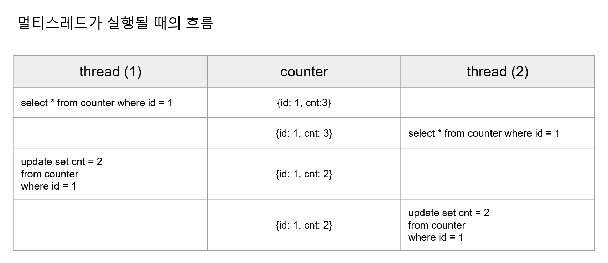

# 2. 멀티스레드 코드에서 데이터 동기화가 실패하는 경우

> 스레드 설명은 항상 어려운데, 글을 주기적으로 업데이트하면서 쉽게 바꿔나갈 예정이다.

<br>

`count` 테이블의 `cnt` 컬럼의 `id=1` 인 로우에 `cnt=100` 이라는 숫자가 저장되어 있을 때 여러개의 스레드가 각각 독자적으로 감소연산을 수행해서, 100번의 연산을 개별적으로 수행해 `cnt=0` 으로 바꿀 수 있을까?<br>

만약, Lock(Optimisitic, Passimistic, Named) 이나 Sychronized, Redis, Redisson 을 활용하지 않고 단순 스레드들을 수행할 경우 원하는 결과값인 `cnt=0` 값에 도달하지 못한다.<br>

먼저 아래의 코드를 예제로 사용한다고 해보자.<br>

<br>

```java
@SpringBootTest
public class CounterServiceTest {
    @Autowired
    private CounterService counterService;

    @Autowired
    private CounterRepository counterRepository;
    
    // --(1)
    // id = 1, cnt = 100 으로 세팅한 후 영속성 컨텍스트 flush
    @BeforeEach
    public void before(){
        Counter counter = new Counter(1L, 100L);
        counterRepository.saveAndFlush(counter);
    }

    // --(4)
    // 테스트가 끝난 후에는 모든 데이터를 지워서 항상 같은 결과를 낼 수 있도록 해준다.
    @AfterEach
    public void after(){
        counterRepository.deleteAll();
    }
    
    
    @Test
    public void 테스트_실패하는_예제__100개의_요청을_비동기_스레드로_동시성프로그래밍_처리() 
        												throws InterruptedException {
        int threadCount = 100;

        // 스레드를 100개 만들어 쓰는 것은 낭비이기에 스레드 풀로 생성해서 100개의 작업을 처리할 
        // availableProcessors 갯수 만큼의 스레드 고정 풀을 생성
        ExecutorService executorService = Executors.newFixedThreadPool(
                        Runtime.getRuntime().availableProcessors()); 

        // 100번의 수행이 되게끔 카운트를 진행한다.
        CountDownLatch latch = new CountDownLatch(threadCount); 

        for(int i=0; i<threadCount; i++){
            executorService.submit(()->{
                try{
                    counterService.decrease(1L, 1L);
                }
                finally {
                    // --(2)
                    latch.countDown();
                }
            });
        }

        // --(3)
        latch.await();

        Counter counter = counterRepository.findById(1L).orElseThrow();
        Assertions.assertThat(counter.getCnt()).isEqualTo(0L);
    }
    
}
```

<br>


테스트 코드의 내용을 요약해보면 이렇다.

테스트 시작 전 (`--(1)`)

- 테스트 시작 전에 {id=1, cnt=100} 이라는 데이터를 저장해둔다.

<br>

테스트 코드 내에서의 동작 

- `--(2)`
  - CountDownLatch는 간단하게 설명하면, countDown 시 마다 작업이 종료되었음을 체크하고, await을 통해 다른 스레드에서의 countDown() 호출을 통한 정해진 count를 소모했는지 여부를 체크해 작업의 종료를 기다리는 역할을 수행한다.
  - countDown() 의 호출은 프로그래머가 작성해줘야 한다.
  - 테스트 시에는 100 개의 작업을 한정된 사이즈의 스레드 풀에서 각각의 스레드에서 실행한다. 
  - 만약 사용가능한 processor 가 4코어라면, 4개의 스레드에서 100개의 작업을 각각 수행하면서 각각의 작업이 정상적으로 종료될 경우 프로그래머의 로직에 의해 countDown()을 수행한다.
- `--(3)`
  - 위의 코드에서는 메인스레드가 CountDownLatch를 통해 100번의 카운트를 수행하는데, 100번의 카운트가 끝난 뒤에는 ExecutorService 로 실행한 스레드 들의 종료가 될 때까지 await으로 기다린다.

<br>

테스트 종료 후의 동작

- `--(4)` 
  - 저장했던 모든 데이터를 지운다.

<br>

위의 코드는 테스트가 실패한다. 테스트가 실패하는 부분을 보면 아래와 같다.

```java
@Test
public void 테스트_실패하는_예제__100개의_요청을_비동기_스레드로_동시성프로그래밍_처리() 
    throws InterruptedException {
    int threadCount = 100;

    ExecutorService executorService = Executors.newFixedThreadPool(
        Runtime.getRuntime().availableProcessors());

    // 100 개의 스레드의 종료를 기다려야 한다.
    CountDownLatch latch = new CountDownLatch(threadCount); 

    for(int i=0; i<threadCount; i++){
        executorService.submit(()->{
            try{
                counterService.decrease(1L, 1L);
            }
            finally {
                latch.countDown();
            }
        });
    }

    latch.await(5L, TimeUnit.SECONDS);

    Counter counter = counterRepository.findById(1L).orElseThrow();
    Assertions.assertThat(counter.getCnt()).isEqualTo(0L);
}
```

<br>

이 코드가 의도한 바는 원래 아래와 같았다. 멀티 스레드 코드를 절차적으로 수행될 것이라고 추측했을 때의 모습이다.<br>



<br>

서로 다른 스레드에서 수행하는데도, 서로 순서를 지켜서 실행될 것이라고 추측해서 코딩하는 조금은 나태한 태도로 추측한 시나리오다.<br>

실무에서 실제로 비동기로직을 이해를 못해 위와 같은 실수를 정직하게 저지르는 동료분을 본적이 있다. 당시 퇴사를 앞둔 시점이어서 간단하게 틀린점을 설명하는데 무슨 이야기인지 도저히 이해를 못했었고 결국 그 친구는 장애를 냈다. 아마도 지금도 그 문제를 해결 못 했을 것 같다고 생각하고 있다.<br>

워낙 고집 센 친구라 설명을 듣지를 않아 힘들었던 적이 꽤 많았던 것 같다.<br>

<br>

실제로는 멀티스레드 상에서 select, update 작업을 수행하면 아래와 같은 시나리오로 수행된다.<br>



<br>

- 1 ) thread (1) 
  - {id:1, cnt:3} 일 때 thread(1) 은 select 쿼리를 통해 데이터를 조회해온다.
- 2 ) thread (2)
  - thread(1) 이 select 쿼리를 통해 데이터를 조회하는 시점에 또 다른 thread (2) 는 비교적 조금 뒤에 select 쿼리를 수행한다.
  - 아직까지 테이블 `counter` 의 데이터는 select 쿼리에 대해 `{id: 1, cnt:3}` 이라는 결과값이 조회된다.
- 3 ) thread (1)
  - update 쿼리를 통해 `{id: 1, cnt: 2}` 로 데이터를 수정한다.
- 4 ) thread (2)
  - update 쿼리를 통해 `{id: 1, cnt : 2}` 로 데이터를 수정한다.

<br>


# 참고

## CounterService

`CounterService.java`

```java
@Service
public class CounterService {

    private final CounterRepository counterRepository;

    public CounterService(CounterRepository counterRepository){
        this.counterRepository = counterRepository;
    }

    public void decrease(Long id, Long diff){
        // get counter
        // counter 감소 연산
        // 결과 저장

        Counter counter = counterRepository.findById(id).orElseThrow();

        counter.decrease(diff);

        counterRepository.saveAndFlush(counter);
    }
}
```

<br>

