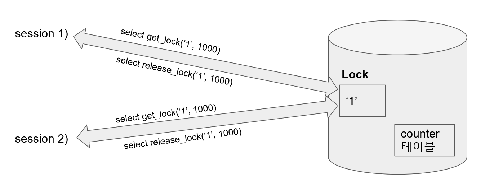

# 3. NamedLock 을 이용한 데이터 동기화

# 참고자료

- [dev.mysql.com/.../locking-functions.html](https://dev.mysql.com/doc/refman/5.7/en/locking-functions.html)

<br>

# Overview

Named Lock 은 테이블에 직접 락을 걸지 않고 따로 공간을 마련해서 락을 건다.<br>

아래 그림의 경우 counter 테이블에 락을 거는 대신 1이라는 이름의 별도의 공간에 락을 걸었다.



테이블에 락을 거는것은 아니지만 DBMS계층에서 DB에 락을 거는 방식이기에 시스템에 부하가 갈 수 있다는 점을 인지해야 한다. 그리고 timeout 을 지정해줘야 락을 획득하기 위해 무한대기하는 상태에 빠지지 않는다.<br>

`mysql` 의 `get_lock` 함수에 대한 참고자료/요약글은 이 글의 최 하단부에 정리해뒀다.<br>

<br>

이 방식의 단점은 timeout과 core 수를 적절하게 조절해줘야 한다는 점이 단점이다. (timeout 동안 락을 획득하도록 하거나 처리 속도를 빠르게 만들거나등의 처리를 해줘야 한다.)<br>

<br>

# 예제 코드

## 테스트 코드

```java
// ...
@SpringBootTest
public class CounterDBLevelLockFacadeTest {

    @Autowired
    private DBLevelLockRepository lockRepository;

    @Autowired
    private CounterRepository counterRepository;

    private CounterService counterService;

    private CounterDBLevelLockFacade facade;

    @BeforeEach
    public void init(){
        counterService = new CounterService(counterRepository);
        facade = new CounterDBLevelLockFacade(counterService, lockRepository);
        counterRepository.saveAndFlush(new Counter(1L, 100L));
    }

    @AfterEach
    public void deleteAll(){
        counterRepository.deleteAll();
    }

    @Test
    public void 멀티스레드환경에서_100개의_요청을_동기화하여_수행() throws InterruptedException {
        int MAX_COUNTING = 100;
        System.out.println("*** core = " + Runtime.getRuntime().availableProcessors());
        ExecutorService service = Executors.newFixedThreadPool(
                Runtime.getRuntime().availableProcessors()/2);

        CountDownLatch latch = new CountDownLatch(MAX_COUNTING);

        for(int i=0; i<MAX_COUNTING; i++){
            service.submit(()->{
                try{
                    facade.decrease(1L, 1L, 9000L);
                } finally {
                    latch.countDown();
                }
            });
        }

        latch.await();

        Counter counter = counterRepository.findById(1L).orElseThrow();
        assertThat(counter.getCnt())
                .isEqualTo(0L);
    }

}

```

<br>

## DBLevelLockRepository.java

```java
// ...

public interface DBLevelLockRepository extends JpaRepository<Counter, Long> {

    @Query(value = "select get_lock(:key, :timeout)", nativeQuery = true)
    void getLock(String key, Long timeout);

    @Query(value = "select release_lock(:key)", nativeQuery = true)
    void releaseLock(String key);

}
```


<br>

## CounterService.java

```java
// ...

@Service
public class CounterService {

    private final CounterRepository counterRepository;

    public CounterService(CounterRepository counterRepository){
        this.counterRepository = counterRepository;
    }

    @Transactional(propagation = Propagation.REQUIRES_NEW)
    public void decrease(Long id, Long diff){
        // get counter
        // counter 감소 연산
        // 결과 저장

        Counter counter = counterRepository.findById(id).orElseThrow();

        counter.decrease(diff);
        System.out.println("after >> counter.cnt = " + counter.getCnt());

        counterRepository.saveAndFlush(counter);
    }
}
```

<br>

## CounterDBLevelLockFacade.java

```java
package io.study.cuncurrency.counter.facade;

import io.study.cuncurrency.counter.repository.DBLevelLockRepository;
import io.study.cuncurrency.counter.service.CounterService;
import org.springframework.stereotype.Component;
import org.springframework.transaction.annotation.Transactional;

@Component
public class CounterDBLevelLockFacade {

    private final CounterService counterService;

    private final DBLevelLockRepository dbLevelLockRepository;

    public CounterDBLevelLockFacade(CounterService counterService, DBLevelLockRepository lockRepository){
        this.counterService = counterService;
        this.dbLevelLockRepository = lockRepository;
    }

    @Transactional
    public void decrease(Long id, Long diff, Long timeout){
        try{
            System.out.println(">>> id = " + String.valueOf(id));
            dbLevelLockRepository.getLock(String.valueOf(id), timeout);
            counterService.decrease(id, diff);
        } finally {
            dbLevelLockRepository.releaseLock(String.valueOf(id));
        }
    }

}
```

<br>

## CounterRepository.java

```java
// ...

public interface CounterRepository extends JpaRepository<Counter, Long> {
}
```

<br>

# MySQL 의 get_lock(str, timeout), get_lock(str)

> 참고 : [dev.mysql.com/.../locking-functions.html](https://dev.mysql.com/doc/refman/5.7/en/locking-functions.html)

`get_lock(str, timeout)` <br>

timeout (Second) 동안 `str` 이라는 이름의 락을 획득한다. 만약 `timeout` 을 음수로 전달할 경우 무한대기를 한다.<br>

<br>

`release_lock(str)`<br>

귀찮다..ㅠㅠ 다음에 정리 예정


